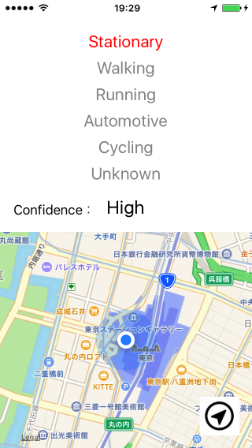

# 移動推定ログ収集アプリ

## ログファイル
アプリを使用すると、Documents下にcsv形式のファイルが保存されます。 
ファイル名は "MotionLog_yyyyMMddhhmmss.csv" の形式で、アプリを起動した時の日時が入ります。 
また、アプリを再起動するたびに、新しくファイルが作られます。

## 保存データ
保存されるデータは以下の内容になります。

|          Time           | Stationary | Walking | Running | Automotive | Cycling | Unknown | Confidence |    Lat    |    Lon     | Accuracy |
|:-----------------------:|:----------:|:-------:|:-------:|:----------:|:-------:|:-------:|:----------:|:---------:|:----------:|:--------:|
| 2017/04/10 12:34:56.789 |     ○      |         |         |            |         |         |    Low     | 35.681382 | 139.766084 |   10.0   |

- Time：そのログが保存された日時
- Stationary~Cycling：移動推定(MotionActivity)でtrueとなったものだけを○で出力。排他ではないため、複数が○になる可能性あり
- Confidence：移動推定の確度。High/Midle/Lowの3パターン
- Lat,Lon：移動推定データが出力される直前に取得された緯度経度。MotionActivityとLocationは別で取得されるため、地下などでは位置情報だけ更新されない可能性あり。なお、測地系はWGS84(世界測地系)
- Accuracy：緯度経度の精度。精度円の半径(m)に相当する

## バックグラウンドでの保存
バックグラウンドでも上記のデータは取得/保存されます。

## 画面イメージ

## 表示内容について
### ・移動推定データ
移動推定でtrueとなったものを赤字で表示し、それ以外はグレーとなります。 
不安定な時は全てグレーになったりします。 
移動推定の確度はその下に High/Midle/Low の3パターンで表示されます。

### ・現在地地図
移動推定データとは別に、現在地がわかるよう現在地の地図表示も行なっています。 
ただし、これはあくまで補足情報として出しただけなので、自位置の表示(青丸)は移動に合わせて更新されるものの、地図の中心位置までは更新されません。 
右下の現在地ボタンを押すと現在地中心で表示されるので、必要に応じてご使用ください。

## 注意
初回起動時に位置情報サービスとモーションアクティビティの使用許可が求められるので許可してください。

## 参考
- CMMotionActivityのAPIリファレンス： 
https://developer.apple.com/reference/coremotion/cmmotionactivity
